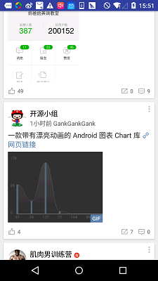
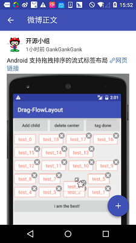
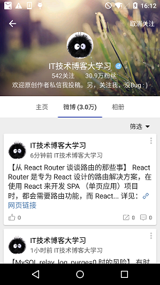

# EMore
微博第三方客户端。项目本来是开源的，由于一些问题将不开源了。

   

   

### Libs
[butterknife](https://github.com/JakeWharton/butterknife) 

[glide](https://github.com/bumptech/glide)  

[stetho](https://github.com/facebook/stetho)

[retrofit](https://github.com/square/retrofit)

[okhttp](https://github.com/square/okhttp)

[leakcanary](https://github.com/square/leakcanary)

[ijk](https://github.com/Bilibili/ijkplayer)

### Contact
[dev.caij@gmail.com](mailto:dev.caij@gmail.com)

### Down
1. fir.im [http://fir.im/6js8](http://fir.im/6js8)
2. App Store：
  - [x] Google Play
  - [x] 应用宝
  - [x] 小米应用商店
  - [x] 魅族
  - [x] 阿里

**本项目中数据来自抓包。如有侵权，告知后会立即删除。**

### License
Copyright (C) 2016 Caij

Licensed under the GNU General Public License v3.0 (GPLv3)
